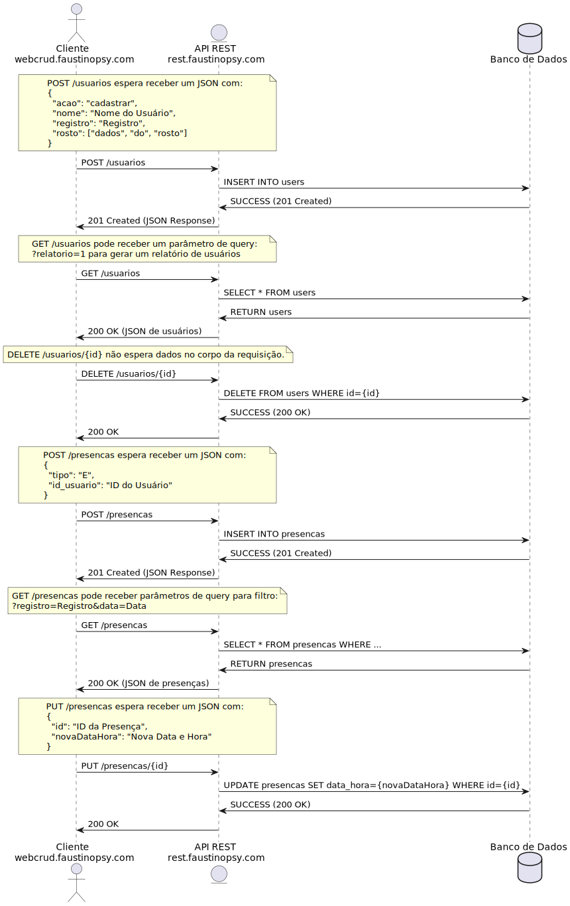
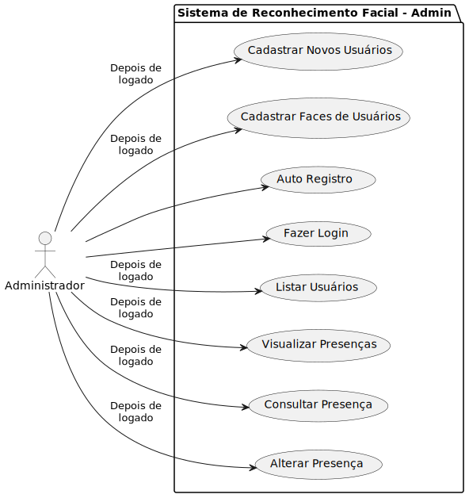
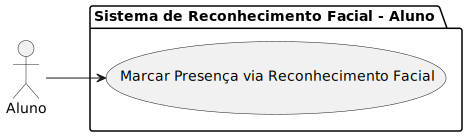
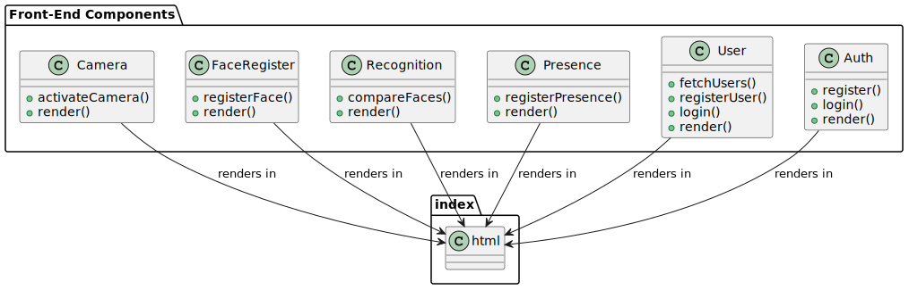
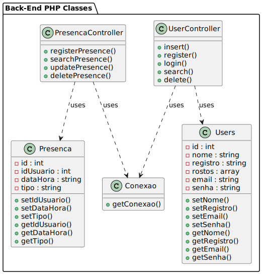
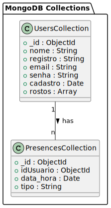

# Aplicação de Reconhecimento Facial

Esta aplicação permite o registro e o reconhecimento facial de alunos para o controle de presença em ambiente acadêmico.

## Introdução

A aplicação cliente comunica com o servidor por meio de uma API REST, utilizando JSON para o envio e recebimento de dados. A aplicação cliente utiliza HTML+ CSS + Javascript, e a aplicação no servidor utiliza Node+Express + MongoDb.

A API do servidor só aceita requisições do domínio rest.faustinopsy.com.

### Fluxo do REST

## Diagramas

### Fluxo do Administrador

### Fluxo do Aluno

### Estrutura de Componentes Front-End

### Classes do Back-End

### Estrutura do Banco de Dados

### Diagrama de Sequência

